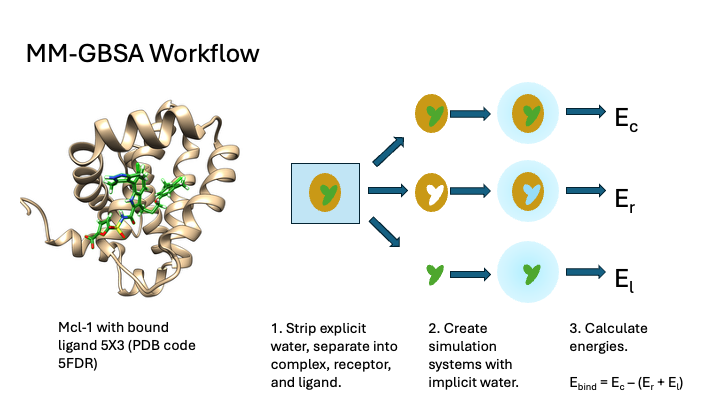

# CCPBioSim MM-GBSA Workshop

This workshop source repository contains the build recipe for a docker container derived from the CCPBioSim JupyterHub image. This container adds the necessary software packages and notebook content to form a deployable course container.

This workshop walks through the process of perfprming a basic MM-GBSA analysis of a molecular dynamics simulation of a protein-ligand complex to estimate the ligand binding free energy. The approach here uses *OpenMM* with a little help from *ParmEd*. 

This example uses data from a simulation performed using *OpenMM*, but could readily be adapted for use with simulations run with *Amber* or *GROMACS* (and maybe *CHARMM*).

## How to Use

This training course is deployed on the [CCPBioSim](www.ccpbiosim.ac.uk) website via our cloud infrastructure, however you can deploy on your own machine with docker.

Pull the container from our repository::

    docker pull ghcr.io/ccpbiosim/mm-gbsa-workshop:latest

In our containers we are using the JupyterHub default port 8888, so you should
forward this port when deploying locally::

    docker run -p 8888:8888 ghcr.io/ccpbiosim/mm-gbsa-workshop:latest

## Authors

Workshop Content Authors:

- Charlie Laughton

## Contact

Please direct all questions and feedback to [Charlie Laughton](mailto:charles.laughton@nottingham.ac.uk)
